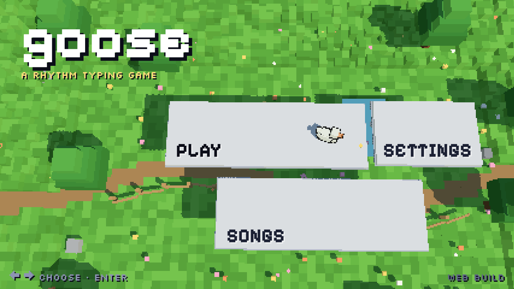
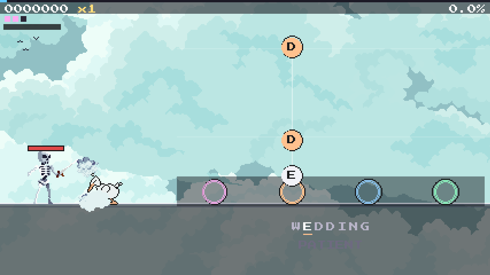
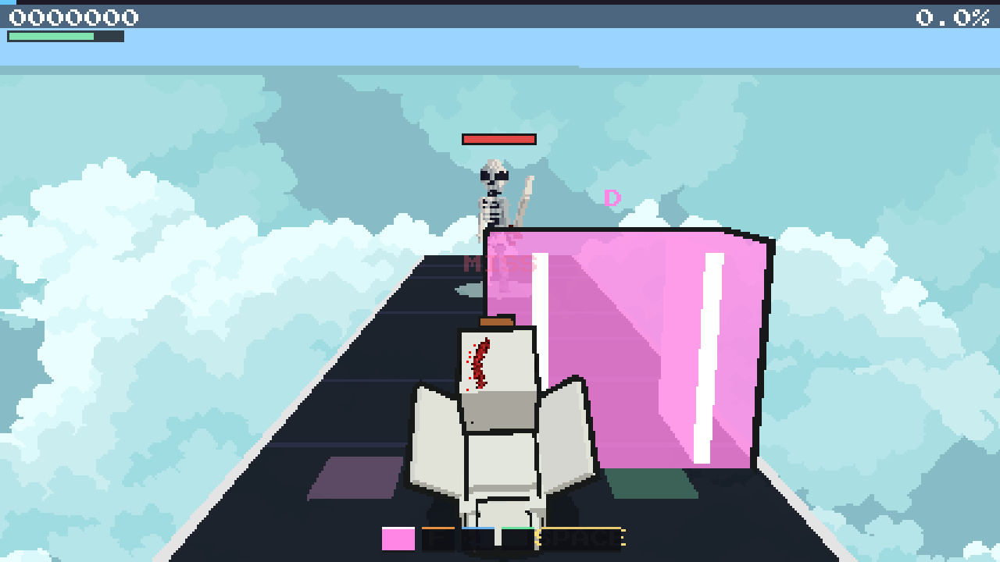
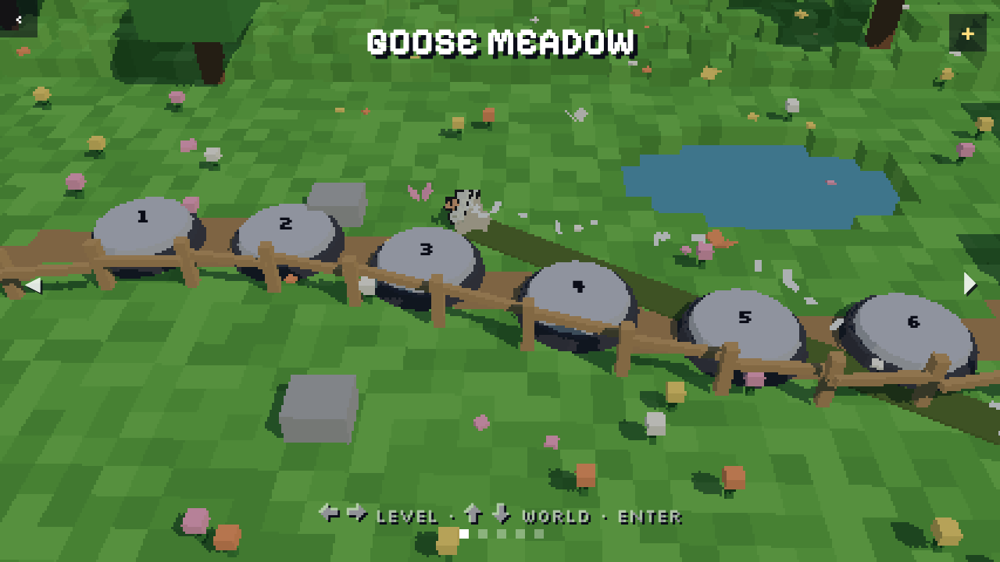
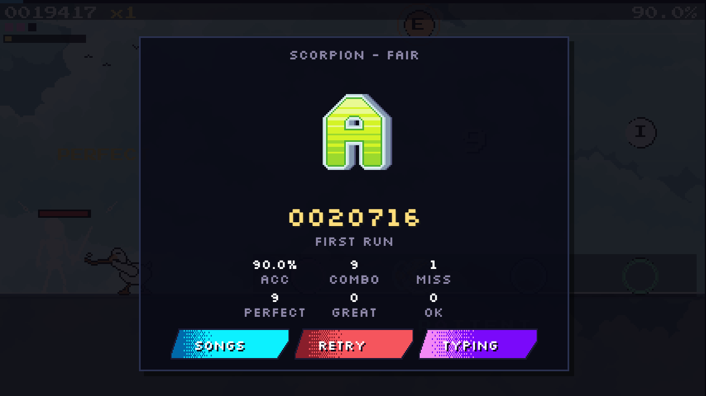
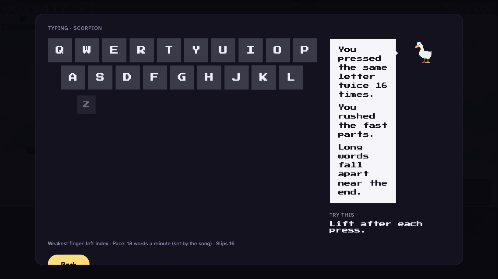
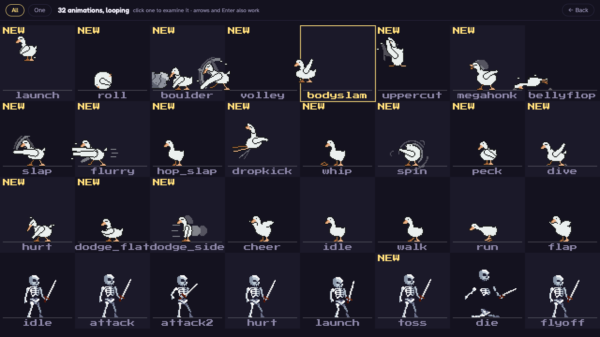

# goose

A rhythm-typing game. Words fall down a four-lane highway in time with the music — one lane per hand zone of the keyboard — and you type them on the beat. Every note you land is a goose hitting something.



```bash
make web      # the web build, on a dev server
make play     # the desktop build (pygame)
make test     # both test suites
```

---

## The game

Pick a song, a difficulty (**Easy · Fair · Hard · Demon**) and a mode. A run starts with a count-in: the clock runs first, the beat rows and the first word are already falling, and the music begins when chart time reaches the lead-in — so every note lands on the audible beat, not near it.

### Words — the Highway

Whole words fall as notes. Strong beats are the coloured notes, off-beats are plain circles. Where the song trades phrases a duet *section* opens: left hand plays the beat, right hand plays the tune, no words. On the left, the goose fights whatever the level sent — every note you land is a slap, a peck, a whip crack or a flurry of punches around them; every note you miss is their turn, unless you land the next note first and dodge.



### Duel — the fight itself, in 3D

The camera sits behind the goose on a slab of dark glass in the level's sky, the enemy at the far end throwing the song at you. Every note is an attack that leaves the enemy early and arrives on the beat, and its shape says what to do: **D**/**K** step out of a laser wall's way, **F** flatten under a blade, **Space** jump a floor wave, **J** peck an orb back — or the enemy itself, when it rushes in on a downbeat. Every dodge answers with a bolt; a miss knocks the goose back and costs HP. Arrow keys work for D F J K. (Charts are still keyed `letters` on disk.)



### The map

Title → the world map: the meadow from above, six numbered stones along the path per world, flags on the ones you have cleared, the goose standing on your pick. A stone's card only opens when you choose it. PLAY brings a saucer whose gloves clap the goose flat into a sprite, then black with the goose running while the song loads, then the fight.



### Keys

| | |
|---|---|
| `Esc` | pause |
| `Space` | Petal Rush, once the bar is half full |
| `Tab` | the typing coach, on the results screen |
| `←` `↓` `↑` `→` | the `onecircle` stage, and D F J K in Duel |

### Scoring

Normalised to 1,000,000: **70 %** accuracy (PERFECT 1.0 · GREAT 0.7 · OK 0.3), **20 %** best combo, **10 %** clean words. Grades go by accuracy — SS at 99.5 % with no miss, then S 95 · A 90 · B 80 · C 70. A wrong key is a *slip*: it never consumes the note and never breaks the combo.

| Results | The typing coach (`Tab`) |
|---|---|
|  |  |

The coach reads the run's hit log rather than the score: a keyboard heatmap, three plain sentences about what your hands actually did, and one thing to try.

---

## Running it

The web client is the current build. It needs its assets generated once — they are derived from `assets/`, so they are not in the repo.

```bash
python3 -m venv venv && source venv/bin/activate
pip install -r requirements.txt

make web              # generates assets if needed, then npm install && npm run dev
```

`make web` is three generators and a dev server:

| | |
|---|---|
| `make assets-art` | sprites, effects, fonts and skies → `web/public/px/` |
| `make assets-audio` | the synthesised sound effects → `web/public/audio/sfx/` |
| `make assets-data` | charts, songs, the menu theme, the recorded effects, the index → `web/public/` |

The desktop build needs no generation step — `make play` runs it straight out of `assets/`.

Songs are analysed once and cached under your user cache directory (`~/Library/Caches/goose` on macOS); `make clean-cache` drops it. Charts for the built-in songs ship in `assets/charts/` — regenerate them with `tools/prechart.py` after changing the generator.

---

## How it is put together

Two builds of one game. The charting pipeline is Python and shared: the desktop build charts a song in-process, and the web client plays charts that Python generated ahead of it, because librosa and scipy are not going to run in a browser tab.

```
charting/           the chart generator ("Skeleton & Cells") — deterministic, cached
  skeleton.py         one decode → beat grid, per-sixteenth band accents (kick/snare/hat/vocal), onsets, slot selection
  engine.py           cells by section energy; slots loudest-hit first, strong beats breaking ties, a rest after every word
  words.py            the word pool (common, fun, school-safe, 2–9 letters)
  duet.py             duet detection and the per-tier trade / echo / weave planner
  letters.py          the Duel planner: ergonomic letter assignment, no words
  __init__.py         build_chart(): the cache, keyed by song + words + difficulty + generator version
analysis/           audio analysis under the charting engine: onsets, energy, downbeats, hold regions
game/               the desktop build (pygame)
  clock.py            ChartClock: the one clock, anchored to the instant the music starts
  rhythm.py           the judgment core: fixed-ms windows (±75 / 150 / 225 ms by tier), signed offsets, holds, hit log, score
  layout.py           every play-screen number in 1920×1080 design units, scaled to fill the window
  keyboard.py         lanes, fingers, hands, mirror keys
  highway.py          the Highway renderer; letters_renderer.py the Duel one
  play.py             PlaySession: load → play → pause → results
  coach/              the typing coach: stats fold, tip library, results panel
web/src/            the web client (TypeScript, Pixi for the pixel buffer, three.js for the menus)
  core/               rhythm.ts, clock, session — the judgment core, ported and held to parity
  px/                 the pixel renderer: highway, duel, actors, combat, effects, scenes
  screens/           title, map, loading, pause, results, settings, gallery — DOM at the same pixel scale
web/tools/          the generators above, plus the browser probes and screenshot tools
tools/              desktop-side tools: prechart, font baking, headless preview
legacy/             the build before this one — the old play loop, its renderers and the
                    pre-Skeleton chart generator.  Imported by nothing; kept to read
userdirs.py         where settings and caches live, in one place
tests/              pytest: charting, judgment, layout, the exporter's cuts, an end-to-end session
web/tests/          vitest: the judgment core, the coach, and desktop/web parity
```

### The clock

One clock, anchored to the AudioContext time the song is scheduled to begin at, with chart time equal to the lead-in at that instant. Nothing re-syncs afterwards, because there is nothing to re-sync to: the chart and the audio are both read off the same hardware sample clock.

### Parity

`web/tests/parity.test.ts` replays cases dumped from the Python judge (`web/tools/parity_dump.py`) through the TypeScript one and requires the same verdicts. It is what keeps two implementations of the same rules from quietly drifting apart.

---

## Your own songs

The desktop build charts an uploaded song in-process. The web client cannot, so charting happens on your machine and the result travels as a file:

```bash
python3 web/tools/chart_file.py "your song.mp3"      # writes "your song.goosechart.json"
```

Drop that file and the audio into **Add a song** in the web client and it plays like a shipped song. Every tier and mode goes into one bundle, so the import screen offers the same choices a built-in song does.

---

## Tests and tools

```bash
make test          # both suites: pytest + vitest
make test-py       # charting, judgment, layout, the exporter's cuts
make test-web      # the judgment core, the coach, parity with the desktop build
make smoke         # a real browser: boot, load a chart, type notes, read the score back
```

Beyond the suites, `web/tools/` holds probes that drive the real client through a flow and screenshot it — `shots-px.mjs` (a song, headless), `shots-end.mjs` (the finish and results), `probe-win.mjs`, `probe-moves.mjs`, `probe-arrows.mjs`, and `shots-readme.mjs`, which is what the pictures on this page come from.

### The move gallery

`/gallery` (or `#gallery`) is every animation the goose and the enemies have, all looping at once on their authored key timings. Click one to examine it on the gallery's own clock: speed (1×, ½, ¼, ⅛), pause and single-step, loop, effects on or off, zoom, enemy and scene.



The goose's moves are **drawn, not transformed** (`web/tools/goose_frames.py`): each is built from a small rig — a body blob that squashes and stretches, a neck that compresses or reaches, legs to wherever the feet are, tapered wings with their own outline — and the fast parts are drawn as speed: translucent ghosts of the wing along its path, an arc where the tip went, dashes behind a dash, dust under a jump.

---

## Credits

Art sources and licences are listed in `assets/pixel/CREDITS.md` — the hit-animation packs are Viktor Hahn's (CC BY 4.0), the skies and several character packs are Craftpix. Sound effects are synthesised in `web/tools/sfx_gen.py`; the goose's waddle and the menu theme are recordings, cut to size by `web/tools/export_web.py`.

The desktop build still draws Noki the cat, the mascot the game had before the goose, and its sprite folders and song filenames still say `noki_` — they are what the saved scores and the chart index are keyed by.
