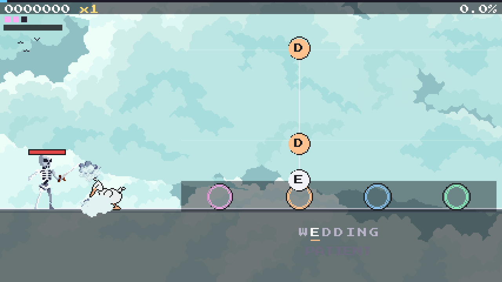

<div align="center">

# goose

**A rhythm-typing game. Words fall on the beat; every one you land is a goose hitting something.**

[](#quick-start)
[](#how-it-works)
[](#quick-start)

</div>


## Overview

Pick a song, a difficulty, and a mode. Songs are analysed once and charted onto a four-lane highway, one lane per hand zone of the keyboard, so every note lands on the audible beat.

## How it works

- **Words.** Whole words fall as notes. Land them and the goose slaps, pecks, or punches whatever the level sent; miss and it is their turn.
- **Duel.** Third-person in 3D. Each note is an attack whose shape tells you the key: `D`/`K` sidestep, `F` duck, `Space` jump, `J` peck it back.
- **Map.** Six stones per world, flags on the ones you have cleared.

Scoring is normalised to 1,000,000: 70% accuracy, 20% best combo, 10% clean words. A wrong key is a slip, never a broken combo. `Tab` on the results screen opens the typing coach.

| Words mode | Duel mode |
|---|---|
|  |  |

## Quick start

```sh
python3 -m venv venv && source venv/bin/activate && pip install -r requirements.txt
make web        # generate assets, then the Vite dev server
make play       # the desktop build (pygame), no generation step
make test       # Python and web suites
```

Song analysis is cached under your user cache directory; `make clean-cache` drops it. The Unity port lives under `Goose/` with its own `make unity-*` targets.

## Repository

| Path | Contents |
|---|---|
| `analysis/`, `charting/` | Audio analysis and the chart generators: words, letters, duets, sections |
| `game/` | The desktop game (pygame) |
| `web/` | The web client (TypeScript, Pixi.js, three.js, Vite) |
| `Goose/` | The Unity 6 port |
| `assets/`, `tools/` | Source art, songs, charts, and the generators behind `make assets` |
| `tests/` | pytest suite |

## Acknowledgements

[librosa](https://librosa.org), [pygame](https://www.pygame.org), [Pixi.js](https://pixijs.com), [three.js](https://threejs.org), [Vite](https://vitejs.dev).
