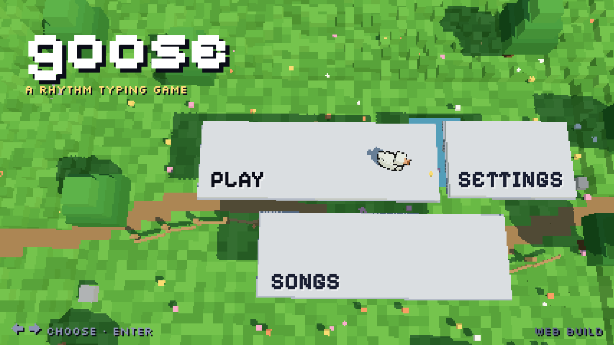
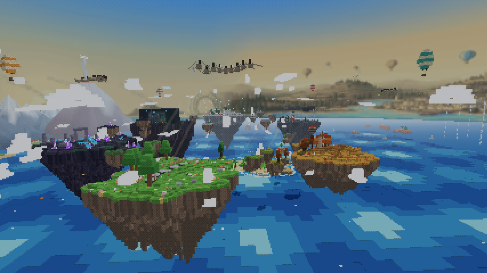
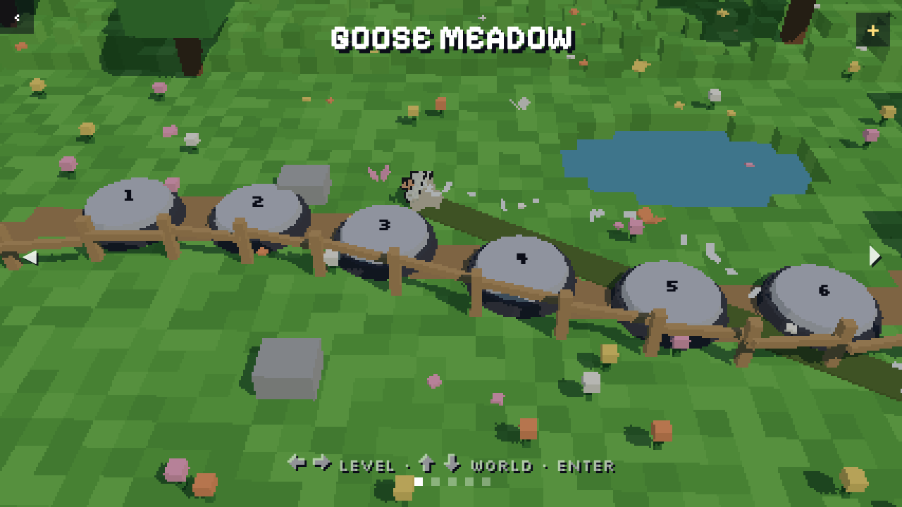
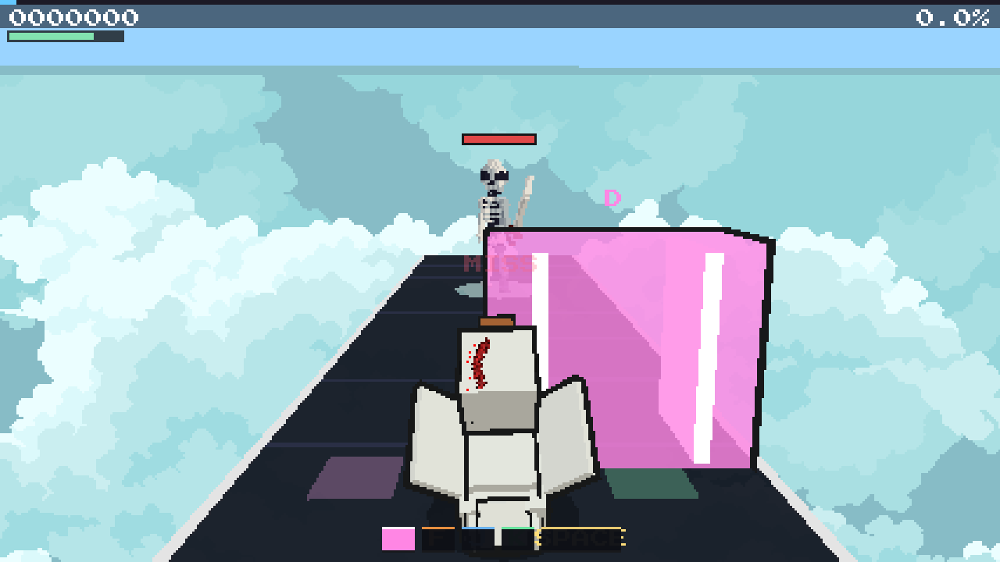

<div align="center">

# goose

[](#quick-start)
[](#quick-start)
[](#quick-start)

</div>

<table>
  <tr>
    <td width="50%"></td>
    <td width="50%"></td>
  </tr>
  <tr>
    <td width="50%"></td>
    <td width="50%"></td>
  </tr>
</table>

## Quick start

```sh
python3 -m venv venv && source venv/bin/activate && pip install -r requirements.txt
make web        # generate assets, then the Vite dev server
make play       # the desktop build (pygame), no generation step
make test       # Python and web suites
```
